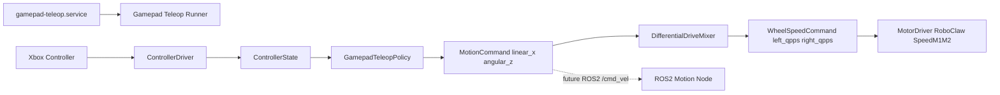

# Boot-Ready Gamepad Teleop Plan

## Goal

Turn the working Xbox 360 controller + RoboClaw speed diagnostic into a boot-ready gamepad teleop service: when the robot is switched on, it waits safely for the controller and RoboClaw, then drives only while RB is held.

The reusable logic should stay framework-agnostic for a future ROS2 migration, but ROS2 readiness is a constraint, not the deliverable. The deliverable is a robot that is out of bench-test mode and ready to control with a gamepad after boot.

## Current State

- `scripts/diagnostics/controller-test.py` proves the Pi receives raw controller events.
- `scripts/diagnostics/controller-state.py` proves the raw events can become normalized controller state.
- `scripts/diagnostics/controller-roboclaw-test.py` proves controller input can drive RoboClaw at low duty with RB as deadman.
- `scripts/diagnostics/controller-roboclaw-speed-test.py` proves controller input can drive RoboClaw using closed-loop `SpeedM1M2` velocity commands with encoder feedback.
- `src/drivers/motor.py` owns direct RoboClaw access and now validates `ReadVersion`.
- `src/drivers/controller.py` already exists, but it should be reconciled with the mappings and behavior proven by the diagnostics.
- `scripts/teleop.py` is keyboard teleop and currently mixes input handling, teleop policy, UI, and motor output in one script.
- `systemd/robot-brain.service` already exists; the gamepad teleop path should integrate with the existing `systemd/` pattern rather than inventing a separate boot mechanism.

## Target Shape



The service is long-running and hardware-tolerant:

- If the controller is absent at boot, the service waits.
- If the controller disconnects or powers off, the service sends stop and waits for it to return.
- If the controller reconnects later, teleop becomes available again without restarting the robot.
- If the RoboClaw is absent or not responding, the service keeps motors stopped and retries until `ReadVersion` succeeds.

## Implementation Plan

1. Normalize the controller driver

   Update `src/drivers/controller.py` using the mappings proven by `scripts/diagnostics/controller-test.py`:

   - Sticks: `ABS_X`, `ABS_Y`, `ABS_RX`, `ABS_RY`
   - Triggers: `ABS_Z`, `ABS_RZ`
   - D-pad: `ABS_HAT0X`, `ABS_HAT0Y`
   - Buttons from the observed Xbox 360 codes, including RB as deadman

   Keep this module pure Python + `evdev`, with no RoboClaw, ROS2, curses, or systemd knowledge.

2. Add reusable control primitives

   Add framework-agnostic modules:

   - `src/control/commands.py`
     - `MotionCommand(linear_x, angular_z)`
     - `WheelCommand(left, right)` as normalized wheel intent
     - `WheelSpeedCommand(left_qpps, right_qpps)` as RoboClaw closed-loop speed targets
   - `src/control/teleop.py`
     - `GamepadTeleopPolicy`
     - Converts `ControllerState` to `MotionCommand`
     - Applies deadman, deadzone, speed limit, optional speed modes
   - `src/control/differential_drive.py`
     - Converts `MotionCommand` to normalized left/right wheel commands
     - Converts normalized wheel commands to capped QPPS speed targets

   Important: teleop should produce a Twist-like command, not RoboClaw duty. The final motor output should preserve the proven closed-loop speed behavior from `scripts/diagnostics/controller-roboclaw-speed-test.py`, using `SpeedM1M2` with conservative QPPS caps rather than regressing to raw duty commands.

3. Promote closed-loop speed control into `MotorDriver`

   Extend `src/drivers/motor.py` with the higher-level RoboClaw speed operations proven by the diagnostic:

   - `set_wheel_speeds(left_qpps, right_qpps)` using `SpeedM1M2`
   - `read_wheel_speeds()` using `ReadSpeedM1` and `ReadSpeedM2`
   - `stop()` continuing to command zero output

   Keep the existing direct duty path only if diagnostics still need it. The normal driving path should use encoder/PID speed commands.

4. Add a boot-ready gamepad teleop runner

   Create a thin wiring script:

   ```text
   ControllerDriver -> GamepadTeleopPolicy -> DifferentialDriveMixer -> MotorDriver.set_wheel_speeds
   ```

   Behavior:

   - Runs forever until the service is stopped.
   - Starts safely even if the controller is not present yet.
   - Reconnects when the controller returns after powering off or disconnecting.
   - Waits for RoboClaw `ReadVersion` and an initial zero-speed command before enabling motion.
   - RB deadman required for motion.
   - Default QPPS speed cap starts conservative, e.g. `--speed-scale 0.25` of configured QPPS.
   - Optional turbo mode can reuse the proven LB behavior from the speed diagnostic.
   - CLI flags allow `--qpps`, `--speed-scale`, `--turbo-scale`, `--deadzone`, `--port`, `--baud`, and `--address`.
   - Releasing RB sends stop.
   - Ctrl+C sends stop and cleans up.
   - Controller disconnect sends stop, logs clearly, and returns to waiting for a controller.

   This can live as `src/gamepad-teleop.py` or `scripts/teleop-gamepad.py`. If it is primarily run by systemd, prefer `src/gamepad-teleop.py` and keep `scripts/` for manual commands.

5. Add `systemd/gamepad-teleop.service`

   Add a dedicated systemd service alongside `systemd/robot-brain.service`:

   - `WorkingDirectory=/home/pi/robot-pet/src`
   - `Environment=PYTHONPATH=/home/pi/robot-pet/src`
   - `ExecStart=/home/pi/robot-pet/.venv/bin/python /home/pi/robot-pet/src/gamepad-teleop.py`
   - `Restart=always`
   - `RestartSec=2`
   - `WantedBy=multi-user.target`

   Keep this separate from `robot-brain.py`. A teleop crash should restart independently, logs should be easy to inspect with `journalctl -u gamepad-teleop -f`, and the service can be deleted cleanly when ROS2 launch files replace systemd wrappers later.

6. Keep diagnostics separate

   Leave `scripts/diagnostics/` as hardware bring-up tools:

   - Raw controller event inspection
   - Normalized controller state inspection
   - Low-duty controller-to-RoboClaw test
   - Closed-loop speed controller-to-RoboClaw test
   - RoboClaw version/command tests

   These scripts remain useful even after full teleop exists.

7. Update setup and docs

   `setup.sh` already installs `evdev` and adds the user to `input`; verify this is enough for the final teleop path.

   Update `setup.sh` to install and enable `gamepad-teleop.service` from the existing `systemd/` directory.

   Update docs with:

   - How to run diagnostics
   - How to run the gamepad service
   - How to inspect logs with `journalctl -u gamepad-teleop -f`
   - How to run a one-off foreground gamepad teleop process for debugging
   - Safety checklist: wheels up first, low speed first, RB deadman, RoboClaw powered and version-readable
   - ROS2 migration note: `MotionCommand` maps directly to future `geometry_msgs/Twist`
   - Keyboard teleop is legacy/manual fallback only; normal driving is gamepad or automation.

## Safety Rules

- No motor command unless the RoboClaw responds to `ReadVersion`.
- No motion unless an initial zero-speed command has succeeded.
- No motion unless RB deadman is held.
- Stop on deadman release.
- Stop on Ctrl+C or normal exit.
- Stop on controller disconnect.
- Continue running and wait for controller reconnect after disconnect.
- Clamp all commands before reaching `MotorDriver`.
- Use closed-loop speed commands with conservative default QPPS caps for normal driving.
- Keep low default speed for the first boot-ready service.

## ROS2 Migration Path

When moving to ROS2:

- Keep `src/drivers/motor.py` as the hardware backend.
- Keep `src/drivers/controller.py` if the Pi still reads the gamepad directly.
- Keep `src/control/teleop.py` and `src/control/differential_drive.py`.
- Replace `src/gamepad-teleop.py` and `systemd/gamepad-teleop.service` with ROS2 nodes/launch files:
  - A teleop node publishes `MotionCommand` as `geometry_msgs/Twist` on `/cmd_vel`.
  - A motion node subscribes to `/cmd_vel`, mixes to wheel speed commands, and calls `MotorDriver.set_wheel_speeds`.

The desired migration is transport-level: Python service loop today, ROS2 topic loop later.

## Suggested First Cut

Implement the reusable pieces first, promote the proven `SpeedM1M2` behavior into `MotorDriver`, then make the boot service small. The diagnostics have already proven the hardware path, so the next risk is turning it into a safe long-running service without adding unnecessary framework machinery.
