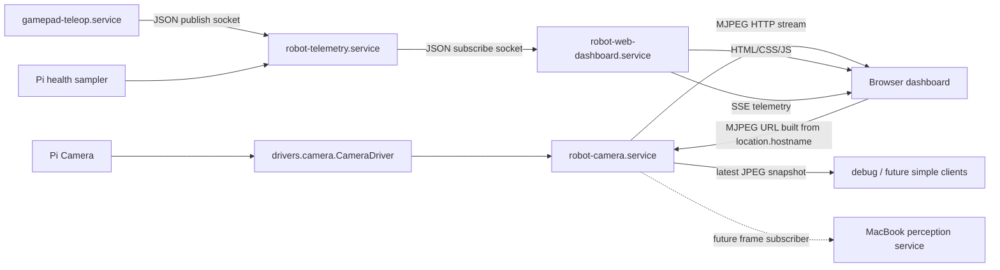

# Web Dashboard + Camera Service Plan

## Goal

Build a simple web dashboard for operating the robot from a browser, with real camera video and the existing telemetry/log/operator controls.

The important architectural change is camera ownership:

- The web dashboard should not open the camera directly.
- The SSH Textual dashboard should stop being the long-term camera owner.
- A dedicated camera service should own the one `CameraDriver` instance.
- Other processes should subscribe to camera output.

Keep this simple, clean, and straightforward. This is not the time for a generic media server, ROS2 bridge, plugin system, React app, or distributed event bus.

## Current State

- `src/robot_dashboard.py` is a foreground SSH Textual dashboard.
- It subscribes to `robot-telemetry` over the existing Unix socket.
- It tails journald for `robot-telemetry`, `gamepad-teleop`, and `robot-brain`.
- It can write drive tuning and restart `gamepad-teleop.service`.
- `CameraPanel` currently instantiates `drivers.camera.CameraDriver` directly.
- `drivers.camera.CameraDriver` is intentionally a pure Python hardware driver and holds the exclusive camera device while started.
- `docs/ARCHITECTURE.md` already says drivers are framework-agnostic and service entrypoints are temporary scaffolding before ROS2.

The current camera path is fine as a prototype, but it puts hardware ownership in a UI. That should be corrected before perception and multiple camera consumers appear.

## Target Shape



## Design Decisions

- Add `robot-camera.service` as the only process that opens the Pi camera.
- Keep `CameraDriver` pure and mostly unchanged.
- Stream browser video as MJPEG for v1.
- Keep camera/video separate from `robot-telemetry`; telemetry remains low-rate JSON state.
- Add `robot-web-dashboard.service` as a small HTTP server for the operator UI.
- Use `aiohttp` for both small HTTP services.
- Use plain HTML/CSS/JavaScript for v1. No frontend build system.
- Keep the existing SSH Textual dashboard usable during the transition, but treat it as a manual/legacy operator tool.
- Do not add browser driving controls in this plan unless explicitly requested later.
- Do not add write/actions to the first web dashboard cut. Config changes, redeploy, and other mutating controls stay in the SSH TUI for now.
- Defer browser log streaming from the first cut.

## Why MJPEG For V1

MJPEG is the simplest way to show real video in a browser:

```html

```

It is not the most bandwidth-efficient option, but it is easy to debug, easy to proxy, and good enough for an operator dashboard on a LAN.

Do not start with WebRTC, HLS, RTSP, GStreamer, or a custom binary WebSocket protocol. Those may become useful later, but they are unnecessary for the first clean version.

## Files To Add

### `src/robot_camera.py`

Add a small camera service.

Responsibilities:

- Instantiate one `CameraDriver`.
- Start it once when the service starts.
- Capture frames continuously on one loop or background thread.
- Encode frames as JPEG.
- Keep the latest JPEG frame in memory.
- Serve:
  - `GET /health` for camera-service health only, not whole-robot health
  - `GET /snapshot.jpg`
  - `GET /stream.mjpg`
- Release the camera cleanly on shutdown.

Suggested runtime defaults:

- Camera source size: `320x240`.
- Stream FPS: start at `10`.
- JPEG quality: start around `75`.
- Bind address: `0.0.0.0`.
- Port: `8081`.

Keep the implementation concrete. A single process with a capture thread and HTTP handlers is enough.

Suggested behavior:

- If the camera cannot open, log a clear error and keep the camera-service `/health` returning a non-OK status.
- If no frame has been captured yet, `/snapshot.jpg` and `/stream.mjpg` should return a simple error response instead of hanging forever.
- If a browser disconnects from `/stream.mjpg`, remove that client and keep serving others.
- Slow camera subscribers must not block frame capture for everyone else.

Implementation note:

- Use Picamera2's direct JPEG capture path, not Pillow or OpenCV, for v1.
- Picamera2 supports writing JPEG data directly to an in-memory `io.BytesIO` with `capture_file(buffer, format="jpeg")`.
- Keep frame capture as "capture latest JPEG bytes" rather than raw-array image processing.
- Avoid adding Pillow, OpenCV, or new NumPy image-processing logic for v1.

### `src/robot_web_dashboard.py`

Add a small web dashboard service.

Responsibilities:

- Serve the operator dashboard HTML/CSS/JS.
- Subscribe to `/run/robot-pet/telemetry-sub.sock`.
- Keep the latest telemetry snapshot in memory.
- Send telemetry updates to browsers using Server-Sent Events.
- Keep the first cut read-only: no drive tuning writes, no redeploy, no browser driving controls.
- Do not run the existing blocking `telemetry.socket_client.subscribe()` iterator directly in the `aiohttp` event loop. Run it in a background thread that updates the latest snapshot.

For the first pass, SSE is enough for live telemetry. Do not add WebSockets or POST endpoints until the web dashboard intentionally grows write actions.

Suggested routes:

- `GET /`
- `GET /static/dashboard.css`
- `GET /static/dashboard.js`
- `GET /events` for telemetry snapshots

Do not make this a generic REST API. Add only routes used by the dashboard.

Remote browser note:

- The dashboard will be opened from a MacBook while the services run on the Raspberry Pi.
- Do not point browser HTML at `127.0.0.1:8081`; that would mean the MacBook, not the Pi.
- The simple v1 approach is for `dashboard.js` to build the camera stream URL from the page host, for example `http://${location.hostname}:8081/stream.mjpg`.
- If cross-port browser behavior becomes annoying, add a narrow `/camera/stream.mjpg` proxy later. Do not start there.

### `src/web_dashboard_static/`

Add static dashboard assets.

Suggested files:

- `index.html`
- `dashboard.css`
- `dashboard.js`

Keep the UI direct and readable. Use semantic HTML and a small amount of JavaScript. Do not add npm, Vite, React, Tailwind, TypeScript, or a bundler for v1.

The page should show:

- Camera view prominently.
- Robot status header: ready/caution/hold, battery voltage, session uptime, telemetry freshness.
- Pi health panel.
- Motor battery panel.
- Controller state panel.
- Wheel/drive panel.
- Link/loop health panel.
- No logs, drive tuning controls, redeploy control, or other write actions in the first cut.

The visual design can reuse the current TUI concepts, but it does not need to mimic terminal art.

### `systemd/robot-camera.service`

Add a systemd unit for the camera service.

Suggested shape:

```ini
[Unit]
Description=Robot Camera Stream
After=network-online.target
Wants=network-online.target

[Service]
Type=simple
User=pi
WorkingDirectory=/home/pi/robot-pet/src
Environment=PYTHONPATH=/home/pi/robot-pet/src
ExecStart=/home/pi/robot-pet/.venv/bin/python /home/pi/robot-pet/src/robot_camera.py
Restart=always
RestartSec=2
StandardOutput=journal
StandardError=journal

[Install]
WantedBy=multi-user.target
```

### `systemd/robot-web-dashboard.service`

Add a systemd unit for the web dashboard.

Suggested shape:

```ini
[Unit]
Description=Robot Web Dashboard
After=robot-telemetry.service robot-camera.service
Wants=robot-telemetry.service robot-camera.service

[Service]
Type=simple
User=pi
WorkingDirectory=/home/pi/robot-pet/src
Environment=PYTHONPATH=/home/pi/robot-pet/src
ExecStart=/home/pi/robot-pet/.venv/bin/python /home/pi/robot-pet/src/robot_web_dashboard.py
Restart=always
RestartSec=2
StandardOutput=journal
StandardError=journal

[Install]
WantedBy=multi-user.target
```

The dashboard should tolerate telemetry or camera being temporarily unavailable. `Wants=` is appropriate; avoid making the dashboard a hard dependency for driving.

## Files To Change

### `src/drivers/camera.py`

Keep this file small.

Change:

- Add `capture_jpeg()` that returns JPEG bytes using Picamera2's `capture_file(io.BytesIO(), format="jpeg")`.
- Keep `capture_array()` for the current TUI path until normal TUI camera ownership is removed.

Do not add web server logic, subscribers, threading, HTTP, or service lifecycle here. The driver owns hardware access only.

### `src/robot_dashboard.py`

Required change:

- After `robot-camera.service` works, replace `CameraPanel` with a static message pointing users to the web dashboard.

Do not leave two normal dashboards that both open the camera. Once `robot-camera.service` exists, the Textual dashboard should not instantiate `CameraDriver` in normal operation.

### `src/telemetry/paths.py`

Add these constants:

```python
DEFAULT_CAMERA_BIND_HOST = "0.0.0.0"
DEFAULT_CAMERA_PORT = 8081
DEFAULT_WEB_DASHBOARD_HOST = "0.0.0.0"
DEFAULT_WEB_DASHBOARD_PORT = 8080
```

Keep configuration minimal. CLI arguments with sensible defaults are enough for v1.

### `pyproject.toml`

Add the smallest dependency set needed.

- Add `aiohttp`.
- Do not add `pillow` for v1; Picamera2 can encode JPEG directly to `BytesIO`.

Avoid adding multiple overlapping web frameworks.

This project uses explicit packaging metadata. If adding `src/robot_camera.py` and `src/robot_web_dashboard.py`, also add them to `py-modules` so editable installs and redeploys include the new entrypoints.

Both services should be simple `aiohttp` apps:

- `robot_camera.py` can run capture in a thread and serve responses from aiohttp handlers.
- `robot_web_dashboard.py` can serve static files, SSE, and a background telemetry task.

### `setup.sh`

Update setup to:

- Install any new Python dependencies from the package metadata.
- Copy the new systemd units.
- Enable/restart `robot-camera.service`.
- Enable/restart `robot-web-dashboard.service`.
- Do not add web-dashboard sudoers permissions in the first cut; the web dashboard is read-only.

### `scripts/redeploy-robot.sh`

Update the redeploy service list so remote redeploys install and restart the new service units:

- `robot-camera.service`
- `robot-web-dashboard.service`

### `docs/ARCHITECTURE.md`

Update the architecture doc:

- Add `drivers/camera.py` to the driver list.
- Add `robot-camera` to current services.
- Add `robot-web-dashboard` to current services.
- Clarify that `robot-camera` owns the camera and fans out frames.
- Clarify that `robot-telemetry` remains JSON state, not video.
- Note that these are pre-ROS2 scaffolding and map naturally to future ROS2 camera/image topics.

### `docs/tui-dashboard.md`

Update this doc if it describes the camera panel as the normal camera view.

The long-term docs should say:

- Use the web dashboard for real video.
- Use the TUI for SSH fallback, telemetry, logs, and emergency/manual operator visibility.

## Implementation Steps

1. Build `robot_camera.py` first.

   Start with only `/health`, `/snapshot.jpg`, and `/stream.mjpg`. Run it manually on the Pi and prove a browser can see real video.

2. Add `systemd/robot-camera.service`.

   Start the service manually, check logs, and confirm the camera stream survives browser refreshes and multiple browser tabs. If stopping after this step, do not enable/deploy it as the normal boot service yet because the SSH TUI can still open the camera.

3. Remove normal dashboard camera ownership from the TUI.

   Replace the TUI camera panel with a static message pointing users to the web dashboard. The goal is one normal camera owner.

4. Build the simplest web dashboard shell.

   Serve `index.html`, CSS, and JS. Show the camera stream first. Build the browser camera URL from `location.hostname` so a remote MacBook loads video from the Pi.

5. Add telemetry streaming.

   Have `robot_web_dashboard.py` subscribe to the existing telemetry socket and expose snapshots to the browser over SSE. Render the existing TUI panels as browser cards.

6. Defer logs.

   Keep logs in the SSH TUI and `journalctl` for the first web dashboard cut. Add browser logs later only if they stay read-only and simple.

7. Defer drive tuning and redeploy.

   These are write actions. Keep them in the SSH TUI until the read-only web dashboard has proven useful.

8. Add `systemd/robot-web-dashboard.service`.

   Confirm the dashboard starts on boot and tolerates camera or telemetry restarts.

9. Update docs and setup.

   Update `ARCHITECTURE.md`, `setup.sh`, and any dashboard docs.

10. Run tests and manual checks.

   Keep tests hardware-free where possible, then do one Pi manual verification pass.

## Test Plan

Add focused tests where they are useful. Do not try to unit-test browser layout.

### Camera Service Tests

- Latest-frame store returns `None` before any frame.
- Latest-frame store updates when a new JPEG arrives.
- `/health` reports unhealthy when camera startup fails.
- `/snapshot.jpg` returns the latest JPEG when available.
- Stream response formats MJPEG boundaries correctly.

Use fake camera/capture objects. Do not require real Pi camera hardware in unit tests.

### Web Dashboard Tests

- Telemetry background task stores the latest snapshot.
- SSE endpoint emits snapshots in browser-readable format.
- Camera stream URL generation uses the remote page hostname rather than `127.0.0.1`.

### Manual Pi Checks

- `python src/robot_camera.py` shows video in a browser.
- `systemctl start robot-camera.service` starts cleanly.
- Two browser tabs can view the stream at the same time.
- `python src/robot_web_dashboard.py` shows camera and live telemetry.
- `systemctl start robot-web-dashboard.service` starts cleanly.
- Restarting `robot-camera.service` makes the dashboard recover or show a clear camera-unavailable state.
- Restarting `robot-telemetry.service` makes telemetry recover or show a clear stale state.
- Driving behavior is unaffected if the web dashboard is stopped.
- Driving behavior is unaffected if the camera service is stopped.
- Opening the dashboard from a remote MacBook loads video from the Raspberry Pi, not from the MacBook localhost.

## Failure Behavior

Handle these as normal runtime states:

- Camera unavailable.
- Browser disconnects mid-stream.
- Telemetry socket unavailable.
- Logs unavailable.
- Camera service restarts while dashboard is open.
- Dashboard service restarts while robot is driving.

The robot should keep driving safely through dashboard/camera failures. Dashboard and camera are operator visibility tools, not motor safety dependencies.

## Out Of Scope For V1

- Browser-based driving controls.
- User accounts or auth.
- HTTPS.
- Remote internet access.
- Video recording.
- Historical telemetry database.
- Browser log streaming.
- Browser drive tuning / config writes.
- Browser redeploy controls.
- WebRTC.
- H.264 streaming.
- GStreamer.
- ROS2 migration.
- MacBook perception integration.
- Generic camera subscriber protocol beyond MJPEG/snapshot.
- Frontend build tooling.
- React/Vue/Svelte.
- npm.

## Future Direction

Once this is working, the next clean step is a camera subscriber API for perception:

- The MacBook perception service subscribes to frames from `robot-camera`.
- It returns perception results to the Pi over a separate clean API.
- Robot safety remains local to the Pi.
- If the MacBook or WiFi disappears, perception becomes unavailable but the robot does not crash.

For ROS2 later:

- `CameraDriver` remains a hardware backend.
- `robot-camera.service` becomes a ROS2 camera node.
- MJPEG dashboard support can either stay as a small bridge or become a debug-only web node.
- Telemetry state maps to ROS2 topics, but the browser dashboard can still consume a web-friendly bridge.

## Suggested First Cut

Do the smallest useful version:

1. `robot-camera` owns the camera and serves MJPEG.
2. A plain web page displays the MJPEG stream.
3. The web page receives current telemetry over SSE.
4. The dashboard shows camera, status, battery, wheels, controller, and link health.
5. Only then consider logs, config, and redeploy.

This gives the robot a real video dashboard while preserving the main architecture rule: hardware drivers stay pure, and service wrappers remain simple enough to throw away when ROS2 arrives.
