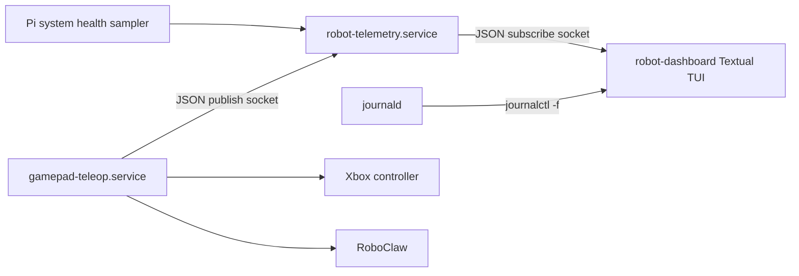

# TUI Dashboard Implementation Plan

## Goal

Build a read-only terminal dashboard for operating the robot over SSH.

The dashboard should show:

- Pi health: uptime, load, memory, disk, temperature, undervoltage/throttling status, and "power-bank battery unavailable".
- Motor battery: RoboClaw 3S LiPo pack voltage, estimated per-cell voltage, and OK/low/critical status.
- Gamepad state: Xbox 360 connectivity, sticks, triggers, D-pad, and buttons in a compact meters/table view.
- Wheel metrics: normalized left/right command, target QPPS, actual QPPS, error, motor current, and stale/read-failure status.
- Logs: live journald tail for `robot-telemetry`, `gamepad-teleop`, and `robot-brain`.

Keep the implementation simple and readable. Avoid framework-like abstractions. This should be a small telemetry hub, a small client helper, a small dashboard app, and focused additions to the teleop service.

## Decisions Carried Forward

- Normal dashboard operation is observe-only.
- `gamepad-teleop.service` keeps owning the controller and RoboClaw.
- Add a separate `robot-telemetry.service` hub.
- Use Unix domain sockets, not files, for live telemetry.
- Use newline-delimited JSON messages.
- Publish live telemetry at 5 Hz.
- Use Textual/Rich for the TUI.
- Run the dashboard manually as a foreground SSH tool.
- TUI v1 is read-only; future write operations are out of scope.

## Implementation Constraints

- Telemetry must not delay the motor command heartbeat. The teleop loop should keep `set_wheel_speeds()` as the priority operation; optional telemetry reads can be skipped, marked failed, or sampled less often if they risk delaying the next command.
- Keep the hub concrete. V1 is not a generic telemetry framework, plugin system, schema registry, or event bus. It accepts `gamepad_teleop` updates, samples Pi health, keeps latest values in memory, and broadcasts one merged snapshot shape.
- Prefer direct dictionaries and tiny helper functions over a deep dataclass model. Add dataclasses only where they make tests or call sites simpler.
- Publishing telemetry is best-effort. If the hub is unavailable or slow, the publisher drops that update and driving continues.
- Build and test the data path before polishing the Textual UI.

## Target Shape



The hub does not talk to hardware. It receives state from services, samples Pi health, stores the latest snapshot in memory, and broadcasts snapshots to dashboard clients.

## Files To Add

### `src/telemetry/messages.py`

Define JSON helpers for the messages we actually need. Start with direct dictionaries plus small functions for JSON-line encode/decode, battery status, and stale labels. Do not introduce a generic schema layer.

Suggested message shape:

```json
{
  "type": "snapshot",
  "time": 1777680000.123,
  "sources": {
    "gamepad_teleop": { "last_seen": 1777680000.000, "stale": false },
    "system": { "last_seen": 1777680000.100, "stale": false }
  },
  "controller": {
    "connected": true,
    "left_stick_x": 0.0,
    "left_stick_y": -0.4,
    "right_stick_x": 0.2,
    "right_stick_y": 0.0,
    "left_trigger": 0.0,
    "right_trigger": 0.0,
    "dpad_x": 0,
    "dpad_y": 0,
    "buttons": {
      "a": false,
      "b": false,
      "x": false,
      "y": false,
      "lb": false,
      "rb": true,
      "back": false,
      "start": false,
      "guide": false,
      "left_stick": false,
      "right_stick": false
    }
  },
  "wheels": {
    "left_command": 0.4,
    "right_command": 0.2,
    "left_target_qpps": 970,
    "right_target_qpps": 485,
    "left_actual_qpps": 930,
    "right_actual_qpps": 500,
    "left_error_qpps": 40,
    "right_error_qpps": -15,
    "left_current_amps": 1.2,
    "right_current_amps": 1.1,
    "read_ok": true
  },
  "motor_battery": {
    "pack_voltage": 11.7,
    "cell_voltage": 3.9,
    "status": "ok"
  },
  "pi": {
    "uptime_seconds": 1234,
    "load_1m": 0.22,
    "memory_used_mb": 320,
    "memory_total_mb": 4096,
    "disk_used_percent": 18,
    "soc_temp_c": 48.5,
    "throttled_flags": "0x0",
    "power_bank_charge": null
  }
}
```

Do not make this a generic schema engine. Direct dictionaries are enough unless a small dataclass clearly makes a test or call site easier to read.

### `src/telemetry/socket_client.py`

Add tiny Unix-socket helpers:

- `publish_message(socket_path, message, timeout=0.1)`.
- `subscribe(socket_path)` generator that yields decoded JSON messages.

Keep reconnect behavior simple:

- Publishers can drop telemetry if the hub is unavailable or slow.
- For v1, use a short-lived Unix stream connection per publish unless implementation shows a simpler option. At 5 Hz this is easy to debug and test; if it becomes noisy later, switch the publisher side to Unix datagram.
- Dashboard subscribers should retry connection and show disconnected/stale state.

### `src/robot_telemetry.py`

Add the telemetry hub service.

Responsibilities:

- Listen on a publisher socket, e.g. `/run/robot-pet/telemetry-pub.sock`.
- Listen on a subscriber socket, e.g. `/run/robot-pet/telemetry-sub.sock`.
- Accept newline-delimited JSON from publishers.
- Keep the latest state per source in memory.
- Sample Pi health at 5 Hz or slower.
- Broadcast a merged snapshot to subscribers at 5 Hz.
- Mark sources stale if no update arrives within a short timeout, such as 1 second.

Keep it single-process and straightforward. `asyncio.start_unix_server()` is fine here because it handles multiple subscribers without threads. Avoid generic source registration or plugin abstractions in v1.

### `src/robot_dashboard.py`

Add the Textual app.

Layout:

- Header: robot name, telemetry connection status, stale/disconnected indicator.
- Left/top: Pi health and motor battery panels.
- Middle: controller state table/meters.
- Middle/right: wheel metrics table.
- Bottom: log pane tailing journald.

Behavior:

- Connect to `/run/robot-pet/telemetry-sub.sock`.
- Keep last values visible when telemetry is stale.
- Use colors for statuses:
  - green: live/ok
  - yellow: stale/low/warning
  - red: disconnected/critical/read failure
- Tail logs with `journalctl -u robot-telemetry -u gamepad-teleop -u robot-brain -f -n 100`.
- Do not send commands to robot services.

The dashboard should be usable with:

```bash
PYTHONPATH=src python src/robot_dashboard.py
```

Optionally add a small executable wrapper later, but do not make packaging a prerequisite for v1.

## Files To Change

### `src/gamepad_teleop.py`

Add telemetry publishing inside the existing control loop.

Publish at 5 Hz, not every 50ms control tick. The runner already computes:

- controller state
- motion command
- wheel target QPPS
- RoboClaw availability

Add the remaining reads near the telemetry tick:

- `motor.read_wheel_speeds()`
- `motor.get_battery_voltage()`
- `motor.get_currents()`

Publish a `gamepad_teleop` update containing controller state, wheel commands, wheel feedback, motor battery voltage, and currents.

Do not let these optional RoboClaw reads delay the drive heartbeat. `set_wheel_speeds()` remains the primary operation in the 50ms control loop. Telemetry reads should run only when the 5 Hz telemetry tick is due, and if they prove slow or fail, publish `read_ok: false` or `null` values instead of blocking the next speed command.

Keep failures local:

- If telemetry publishing fails, continue driving.
- If optional telemetry reads fail, publish `read_ok: false` or `null` values without interrupting motor safety behavior.
- Do not let dashboard/telemetry problems block the control loop.

### `src/drivers/motor.py`

Keep hardware methods simple. Existing methods already cover v1:

- `get_battery_voltage()`
- `get_currents()`
- `read_wheel_speeds()`
- `set_wheel_speeds()`

Only change this file if tests expose a mismatch with BasicMicro return shapes or if `stop()` should also use zero speed mode for consistency.

### `systemd/robot-telemetry.service`

Add a systemd unit:

- `WorkingDirectory=/home/pi/robot-pet/src`
- `Environment=PYTHONPATH=/home/pi/robot-pet/src`
- `ExecStart=/home/pi/robot-pet/.venv/bin/python /home/pi/robot-pet/src/robot_telemetry.py`
- `Restart=always`
- `RestartSec=2`
- `RuntimeDirectory=robot-pet`
- `RuntimeDirectoryMode=0755`
- `StandardOutput=journal`
- `StandardError=journal`

The runtime directory should own the `/run/robot-pet/*.sock` paths so `User=pi` can create sockets without ad hoc setup steps. Keep socket permissions compatible with `gamepad-teleop.service` and a foreground dashboard run by the Pi user.

Start it before `gamepad-teleop.service` if practical:

- `gamepad-teleop.service` can add `Wants=robot-telemetry.service`.
- It should not require telemetry to drive safely.

### `setup.sh`

Install dependencies:

- `textual`
- `rich` if not pulled transitively enough for direct imports

Enable/restart `robot-telemetry.service` alongside existing services.

### `docs/ARCHITECTURE.md`

Update the current service table:

- `robot-telemetry`: in-memory local telemetry hub for dashboard clients.
- `robot-dashboard`: foreground SSH TUI, not a systemd service.

Add a short note that telemetry hub and dashboard are pre-ROS2 scaffolding. Hardware drivers remain framework-agnostic.

### `docs/gamepad-teleop.md` or a new `docs/tui-dashboard.md`

Document:

- How to start the dashboard.
- What each panel means.
- Why Pi power-bank charge is unavailable.
- Motor LiPo voltage thresholds.
- How to inspect telemetry service logs.

## Implementation Steps

1. Add telemetry message/client helpers.

   Keep the helpers tiny and stdlib-only. Unit test JSON round-tripping and socket reconnect behavior where practical.

2. Add `robot_telemetry.py`.

   Start with one publisher socket, one subscriber socket, in-memory latest state, Pi health sampling, and 5 Hz snapshots.

3. Add tests for the telemetry hub.

   Use temporary Unix socket paths. Test that a publisher update appears in subscriber snapshots and that stale sources are marked stale.

4. Wire `gamepad_teleop.py` into telemetry.

   Publish gamepad/wheel/RoboClaw state at 5 Hz. Keep publish failures non-fatal, and keep optional telemetry reads from delaying the next motor command heartbeat.

5. Add tests for teleop telemetry publishing.

   Use fake controller, fake motor, and fake publisher. Verify published values include controller buttons, target QPPS, actual QPPS, currents, and battery voltage.

6. Add the Textual dashboard.

   Build static panels first, then connect live telemetry. Keep rendering code direct and readable. Do this after a tiny subscriber can already print live hub snapshots.

7. Add journald tailing to the dashboard.

   Run `journalctl` as a subprocess and append lines to the log pane. If journald is unavailable, show a visible log error but keep telemetry panels working.

8. Add systemd/setup/docs updates.

   Enable `robot-telemetry.service`, install dependencies, and document usage.

9. Run tests.

   Run the existing test suite plus new telemetry/dashboard unit tests. Do not require real hardware for tests.

## Pi Health Details

Prefer simple Linux/Raspberry Pi sources:

- Uptime: `/proc/uptime`
- Load: `/proc/loadavg`
- Memory: `/proc/meminfo`
- Disk: `shutil.disk_usage("/")`
- Temperature:
  - prefer `vcgencmd measure_temp` if present
  - otherwise read `/sys/class/thermal/thermal_zone0/temp` if present
- Throttling/undervoltage:
  - prefer `vcgencmd get_throttled` if present
  - otherwise report unavailable

Do not invent Pi battery percentage. Show `power_bank_charge: null`.

## Motor Battery Status Bands

Use simple 3S LiPo thresholds:

- `ok`: at or above 10.8V pack.
- `low`: below 10.8V pack and above 10.5V pack.
- `critical`: at or below 10.5V pack.
- `unknown`: voltage read failed.

The motor rail cutoff is 10.5V. The dashboard should warn below 10.8V.

## Test Plan

Add focused stdlib `unittest` coverage:

- Message encoding/decoding:
  - JSON line round trip.
  - Missing optional values stay `None`.
- Telemetry hub:
  - Accepts publisher updates.
  - Broadcasts merged snapshots to subscribers.
  - Marks stale source after timeout.
  - Keeps running when a subscriber disconnects.
- Teleop telemetry:
  - Publishes controller state and wheel target state.
  - Includes actual wheel speeds, battery voltage, and currents when reads succeed.
  - Publishes failed/unknown read status when reads fail.
  - Driving continues if telemetry publish fails.
  - Driving continues if optional telemetry reads fail or are skipped.
- Pi health sampler:
  - Parses representative `/proc` and `vcgencmd` outputs through injectable readers.
- Dashboard formatting helpers:
  - Motor battery status bands.
  - Stale/disconnected label selection.
  - Wheel error calculation display.

Avoid tests that need real RoboClaw, real controller hardware, real systemd, or real journald.

## Out Of Scope For V1

- Sending commands from the dashboard.
- Service restart buttons.
- Changing speed scale from the TUI.
- Accurate Pi power-bank percentage.
- ROS2 migration.
- Web dashboard.
- Fancy ASCII gamepad diagram.
- Historical telemetry storage.
- Long-term metrics database.

## Suggested First Cut

Build the data path before polishing the UI:

1. `gamepad-teleop` publishes one JSON update.
2. `robot-telemetry` receives it and broadcasts snapshots.
3. A tiny CLI subscriber prints snapshots.
4. Textual dashboard renders those snapshots.
5. Add logs and visual polish once the live state path is reliable.

This keeps the risk where it belongs: proving the live telemetry plumbing without touching motor safety behavior.
