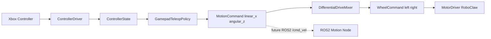

# Gamepad Teleop ROS2-Ready Plan

## Goal

Turn the working Xbox 360 controller + RoboClaw diagnostic into a proper gamepad teleop path while keeping the reusable logic framework-agnostic for a future ROS2 migration.

The current architecture already says: drivers are pure Python and systemd/service wrappers are temporary. This plan keeps that boundary: controller reading, teleop policy, and differential-drive math should be reusable later inside ROS2 nodes.

## Current State

- `scripts/diagnostics/controller-test.py` proves the Pi receives raw controller events.
- `scripts/diagnostics/controller-state.py` proves the raw events can become normalized controller state.
- `scripts/diagnostics/controller-roboclaw-test.py` proves controller input can drive RoboClaw at low duty with RB as deadman.
- `src/drivers/motor.py` owns direct RoboClaw access and now validates `ReadVersion`.
- `src/drivers/controller.py` already exists, but it should be reconciled with the mappings and behavior proven by the diagnostics.
- `scripts/teleop.py` is keyboard teleop and currently mixes input handling, teleop policy, UI, and motor output in one script.

## Target Shape



## Implementation Plan

1. Normalize the controller driver

   Update `src/drivers/controller.py` using the mappings proven by `scripts/diagnostics/controller-test.py`:

   - Sticks: `ABS_X`, `ABS_Y`, `ABS_RX`, `ABS_RY`
   - Triggers: `ABS_Z`, `ABS_RZ`
   - D-pad: `ABS_HAT0X`, `ABS_HAT0Y`
   - Buttons from the observed Xbox 360 codes, including RB as deadman

   Keep this module pure Python + `evdev`, with no RoboClaw, ROS2, curses, or systemd knowledge.

2. Add reusable control primitives

   Add framework-agnostic modules:

   - `src/control/commands.py`
     - `MotionCommand(linear_x, angular_z)`
     - `WheelCommand(left, right)`
   - `src/control/teleop.py`
     - `GamepadTeleopPolicy`
     - Converts `ControllerState` to `MotionCommand`
     - Applies deadman, deadzone, speed limit, optional speed modes
   - `src/control/differential_drive.py`
     - Converts `MotionCommand` to normalized left/right wheel commands

   Important: teleop should produce a Twist-like command, not RoboClaw duty. That makes the later ROS2 version publish `/cmd_vel` instead of rewriting the policy.

3. Add `scripts/teleop-gamepad.py`

   Create a thin wiring script:

   ```text
   ControllerDriver -> GamepadTeleopPolicy -> DifferentialDriveMixer -> MotorDriver
   ```

   Behavior:

   - RB deadman required for motion.
   - Default speed cap starts conservative, e.g. `0.20`.
   - CLI flags allow `--max-speed`, `--deadzone`, `--port`, `--baud`, and `--address`.
   - Releasing RB sends stop.
   - Ctrl+C sends stop and cleans up.
   - Controller disconnect sends stop and exits clearly.

4. Keep diagnostics separate

   Leave `scripts/diagnostics/` as hardware bring-up tools:

   - Raw controller event inspection
   - Normalized controller state inspection
   - Low-duty controller-to-RoboClaw test
   - RoboClaw version/command tests

   These scripts remain useful even after full teleop exists.

5. Update setup and docs

   `setup.sh` already installs `evdev` and adds the user to `input`; verify this is enough for the final teleop path.

   Update docs with:

   - How to run diagnostics
   - How to run `scripts/teleop-gamepad.py`
   - Safety checklist: wheels up first, low speed first, RB deadman, RoboClaw powered and version-readable
   - ROS2 migration note: `MotionCommand` maps directly to future `geometry_msgs/Twist`

## Safety Rules

- No motor command unless the RoboClaw responds to `ReadVersion`.
- No motion unless RB deadman is held.
- Stop on deadman release.
- Stop on Ctrl+C or normal exit.
- Stop on controller disconnect.
- Clamp all commands before reaching `MotorDriver`.
- Keep low default speed for the first real driving script.

## ROS2 Migration Path

When moving to ROS2:

- Keep `src/drivers/motor.py` as the hardware backend.
- Keep `src/drivers/controller.py` if the Pi still reads the gamepad directly.
- Keep `src/control/teleop.py` and `src/control/differential_drive.py`.
- Replace `scripts/teleop-gamepad.py` with ROS2 nodes:
  - A teleop node publishes `MotionCommand` as `geometry_msgs/Twist` on `/cmd_vel`.
  - A motion node subscribes to `/cmd_vel`, mixes to wheel commands, and calls `MotorDriver`.

The desired migration is transport-level: Python script loop today, ROS2 topic loop later.

## Suggested First Cut

Implement the reusable pieces first, then make `scripts/teleop-gamepad.py` small. The diagnostics have already proven the hardware path, so the next risk is code organization rather than hardware compatibility.
